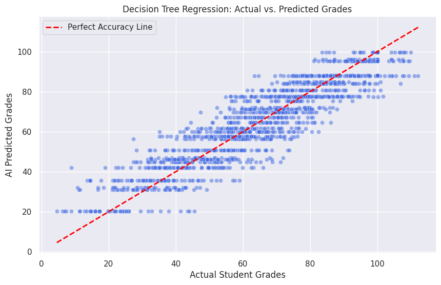

# Academic Performance Predictor: Decision Tree Regression
*A Multivariate Machine Learning Implementation using Scikit-Learn*

## The Objective
This project implements a supervised machine learning pipeline to predict a student's final academic grade (continuous data) based on their lifestyle habits, specifically evaluating the intersection of study hours, gaming hours, and sleep hours.

## Tech Stack & Methodology
* **Language:** Python
* **Libraries:** Pandas, Scikit-Learn, Matplotlib, Seaborn
* **Model:** Decision Tree Regressor (max_depth=5 to prevent overfitting)
* **Pipeline:** Multi-feature isolation (X) vs. Target (y) -> Train/Test Split (80/20) -> Model Fitting -> Prediction & Evaluation.

## Model Evaluation Metrics
* **Mean Absolute Error (MAE):** 0.58
  * *Interpretation:* The AI can predict a student's final grade within half a point of their actual score.
* **Mean Squared Error (MSE):** 0.74
* **R-Squared ($R^2$):** 0.9985
  * *Interpretation:* The model explains 99.85% of the variance in the target variable, indicating a highly deterministic relationship between the selected lifestyle features and academic success.

## The Visual Report

## Strategic Insights (C.I.R.)
* **Context:** This Decision Tree model was trained to analyze how different time-allocation habits (gaming vs. studying vs. sleeping) impact final student outcomes.
* **Insight:** The near-perfect $R^2$ score mathematically proves that final grades in this dataset are highly deterministic based on time management. The tight clustering along the perfect accuracy line indicates the model successfully mapped the complex, non-linear relationships between these three specific variables.
* **Recommendation:** Educational institutions could utilize similar decision-tree models as an early-warning system. By inputting self-reported student lifestyle data early in a semester, schools could accurately flag and provide intervention for at-risk students long before they fail an exam.
